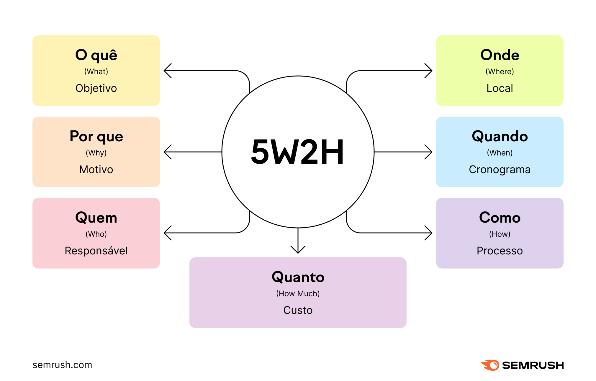

# 1.2.2 5W2H

# Introdução

O 5W2H é uma técnica criada no Japão no ano de 1950 no contexto industrial por Taiichi Ohno e Eiji Toyoda. Ela tem como objetivo criar ckecklists envolvendo um projeto através de prazos, responsabilidades e atividades a serem desenvolvidos pelos integrantes do projeto em questão. Isso veio em meio ao propósito de organizar a maneira sobre a qual os projetos eram realizados.

# Metodologia

A execução dessa técnica consiste em realizar um conjunto de perguntas acerca do próprio projeto em questão, sendo elas "O quê", "Por que", "Quem", "Onde", "Quando", "Como" e "Quanto". Elas deverão abordar as principais funcionalidades da aplicação.

# Aplicação da metodologia

|Nº | O quê |  Por Que | Onde |Quando| Quem   |Como  | Quanto custa|
| ---| ---| ---| ---| ---| ---| ---|--- | 
|01 | Site o qual possibilita a troca, doação e venda de itens de frequentadores(estudantes, professores, técnicos e servidores administrativos, etc.) da FCTE | Fomentar e facilitar a o desapego de itens não mais necessários dentro da comunidade da FCTE | FCTE | Durante períodos letivos | Frequentadores da FCTE | através do uso do site eles poderão anunciar os itens que quiserem desapegar| trabalho voluntário| 
||||||||

## What

## Why 

## Where

## When

## Who