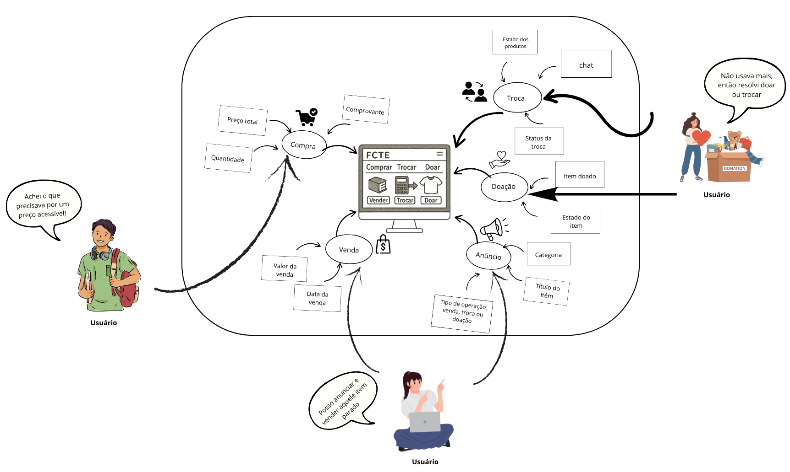
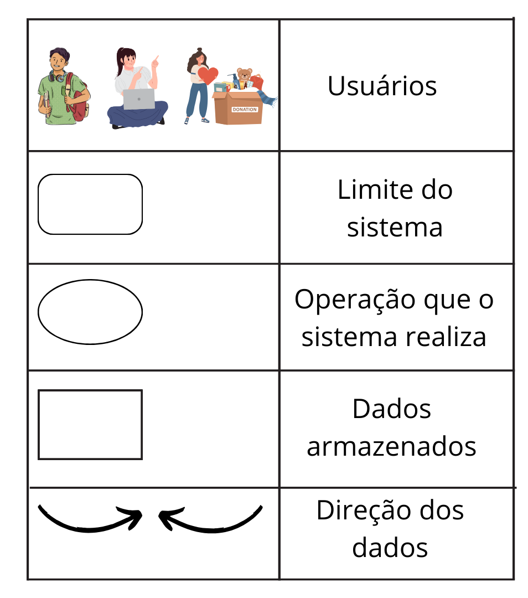

# 1.2.3 Rich Picture

## Intrudução 

O rich picture é uma técnica amplamente utilizada na fase de levantamento e análise de requisitos de sistemas de software. Essa abordagem tem como principal objetivo representar, de forma visual e informal, o contexto de um problema ou situação organizacional, permitindo a identificação de elementos-chave como atores, processos, relações, conflitos e fluxos de informação. Diferente de diagramas técnicos ou notações formais, o rich picture utiliza desenhos, ícones e textos livres, facilitando a comunicação entre desenvolvedores, usuários e demais stakeholders.

## Ferramentas utilizadas 

A construção do Rich Picture apresentado na Figura 1 foi realizada por meio da ferramenta Canva. A Figura 2 apresenta a legenda explicativa, contendo a descrição dos elementos utilizados na representação visual.

**Figura 01** - Rich Picutre FCTE-Desapega

**Figura 02** - Legenda explicativa

## Histórico de Versões
| Versão | Data       | Descrição              | Autor(es)                                           | Revisor(es) |
|--------|------------|------------------------|-----------------------------------------------------|-------------|
| 1.0    | 08/04/2025 | Verificação e Validação | [Karolina Vieira](https://github.com/Karolina91) | -           |
