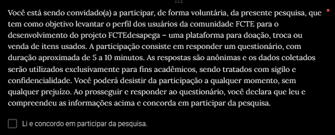

# 1.2.6 Perfil do Usuário

## Introdução
Para compreender melhor os possíveis usuários do site, foi elaborado um perfil genérico conhecido como perfil de usuário. Segundo Barbosa e Silva[¹](#1), o perfil de usuário é uma descrição detalhada das características dos usuários, cujos objetivos precisam ser apoiados pelo sistema em desenvolvimento.

## Metodologia
A coleta de dados foi realizada principalmente por meio de um [questionário](../1.3.TecnicasElicitacao/1.3.2.Questionario.md) elaborado para o futuro site do FCTEDesapega. Para complementar, foi usada uma ferramenta de análise de tráfego de rede, que permitiu validar as informações obtidas. O questionário continha 9 perguntas sobre aspectos gerais dos usuários em questão de perfil de vendas, trocas e doações e foi divulgado em grupos comunitários no aplicativos WhatsApp, entre os dias 03 e 05 de Abril de 2025.

## Resultado do [ Questionário ](../1.3.TecnicasElicitacao/1.3.2.Questionario.md)

O [questionário](../1.3.TecnicasElicitacao/1.3.2.Questionario.md) recebeu um total de 20 respostas, conforme indicado no termo de consentimento a seguir.

---

<em>Renata Quadros, 2025.</em>

---

### Principais Características do Perfil de Usuário

#### Perfil Geral do perfil de usuário
Tendo como base uma análise feita sobre o questionário, o perfil dos usuários revela um grupo predominantemente composto por jovens adultos universitários. O interesse em vender ou adquirir itens usados, especialmente materiais úteis para certas disciplinas como DIAC, ou itens comuns a vida universitária como notebooks, tablets, etc, aponta para um interesse colaborativo economia circular dentro do ambiente acadêmico. 

Além disso, o grupo apresenta expectativa de um ambiente transparente, que permita controle sobre os próprios dados e postagens, livre de práticas invasivas. Há também uma valorização clara por conexões autênticas e iniciativas que fortaleçam a comunidade universitária. E por fim, a expectativa de segurança ao se procurar serviços como vendas, trocas ou doações num ambiente onde se possa ter uma procedência de quem são os envolvidos por trás das postagens de quem anuncia, antes de se encontrar fisicamente com o anunciante. 

Abaixo foi detalhado mais ativamente as características do perfil de usuário.

#### Dados Demográficos
  - **Idade:** Predominância de jovens adultos entre 18 e 22 anos.
  - **Ocupação:** Maioria estudantes universitários ou em início de carreira.
  - **Educação:** Alto nível de envolvimento acadêmico, sugerindo usuários com bom letramento digital.

#### Objetivos de uso da plataforma
  - Segundo as respostas do questionário, os usuários tem uma maior interesse em vender itens usados
  - Encontrar materias usados, mas em boa qualidade, úteis para calouros
  - Ter acesso à um ambiente acadêmico de trocas com a facilidade de encontrar o que precisa

#### Privacidade e Segurança:
  - Altamente consciente sobre questões de privacidade e controle de dados.
  - Espera funcionalidades claras para gerenciar quem pode visualizar suas postagens e acessar suas informações.
  - Evita plataformas que utilizam algoritmos invasivos para coleta ou venda de dados.

### Valores e Expectativas

#### Valores:
  - Conexões autênticas.
  - Respeito à privacidade.
  - Transparência nas práticas de uso e coleta de dados.

#### Expectativas:
  - Segurança durante o uso da plataforma 
  - Segurança ao se encontrar com um vendedor/doador
  - Funcionalidades que ajudem a comunidade

## Referência Bibliográfica
> 1. BARBOSA, S. D. J.; SILVA, B. S. Interação Humano-Computador. Rio de Janeiro: Elsevier, 2011.

## Bibliografia
> 1. Requisitos de Software 2024.2 Grupo01. 2024. Autora: Renata Tavares. Disponível em: <https://github.com/Requisitos-de-Software/2024.2-Grupo01>  Acessado 01/12/2024 ás 09:55

<strong> Histórico de Versões</strong>

<table style="margin: auto; width: 60%; border-collapse: collapse;" border="1" cellpadding="8">
  <thead>
    <tr>
      <th style="text-align: center;">Versão</th>
      <th style="text-align: center;">Data</th>
      <th style="text-align: center;">Descrição</th>
      <th style="text-align: center;">Autor(es)</th>
      <th style="text-align: center;">Revisor(es)</th>
    </tr>
  </thead>
  <tbody>
    <tr>
      <td style="text-align: center;">1.0</td>
      <td style="text-align: center;">10/04/2025</td>
      <td style="text-align: center;">Criação do documento.</td>
      <td style="text-align: center;"><a href="https://github.com/GabrielSMonteiro">Gabriel Monteiro</a></td>
      <td style="text-align: center;"><a href="https://github.com/arthur-suares">Arthur Suares</a></td>
    </tr>
  </tbody>
  <tbody>
    <tr>
      <td style="text-align: center;">1.1</td>
      <td style="text-align: center;">10/04/2025</td>
      <td style="text-align: center;">Adição de perfil geral e objetivos de uso</td>
      <td style="text-align: center;"><a href="https://github.com/arthur-suares">Arthur Suares</a></td>
      <td style="text-align: center;"><a href="https://github.com/GabrielSMonteiro">Gabriel Monteiro</a></td>
    </tr>
  </tbody>
    <tbody>
    <tr>
      <td style="text-align: center;">1.2</td>
      <td style="text-align: center;">10/04/2025</td>
      <td style="text-align: center;">Adição do termo de consentimento</td>
      <td style="text-align: center;"><a href="https://github.com/GabrielSMonteiro">Gabriel Monteiro</a></td>
      <td style="text-align: center;"></td>
    </tr>
  </tbody>

</table>