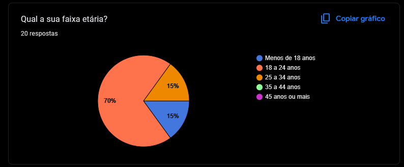

# 1.2.6 Perfil do Usuário

## Introdução
Para compreender melhor os possíveis usuários do site, foi elaborado um perfil genérico conhecido como perfil de usuário. Segundo Barbosa e Silva[¹](#1), o perfil de usuário é uma descrição detalhada das características dos usuários, cujos objetivos precisam ser apoiados pelo sistema em desenvolvimento.

## Metodologia
A coleta de dados foi realizada principalmente por meio de um [questionário](../1.3.TecnicasElicitacao/1.3.2.Questionario.md) elaborado para o futuro site do FCTEDesapega. Para complementar, foi usada uma ferramenta de análise de tráfego de rede, que permitiu validar as informações obtidas. O questionário continha 9 perguntas sobre aspectos gerais dos usuários em questão de perfil de vendas, trocas e doações e foi divulgado em grupos comunitários no aplicativos WhatsApp, entre os dias 03 e 05 de Abril de 2025.

## Resultado do Questionário

O questionário recebeu um total de 20 respostas, conforme indicado no termo de consentimento.

---

De acordo com a figura 3, a idade dos participantes em sua maioria são entre 18 e 22 anos.

<b>Figura 3:</b> Questão 3

<b>Autor:</b> <a href="https://github.com/GabrielSMonteiro">Gabriel Monteiro</a>
 

---

### Principais Características do Perfil de Usuário

#### Dados Demográficos
  - Idade: Predominância de jovens adultos entre 18 e 22 anos.
  - Ocupação: Maioria estudantes universitários ou em início de carreira.
  - Educação: Alto nível de envolvimento acadêmico, sugerindo usuários com bom letramento digital.
#### Comportamento de Uso
##### Motivação para Uso de Redes Sociais:
##### Tipos de Conteúdo Consumido e Compartilhado:
#### Preferências de Experiência
##### Privacidade e Segurança:
  - Altamente consciente sobre questões de privacidade e controle de dados.
  - Espera funcionalidades claras para gerenciar quem pode visualizar suas postagens e acessar suas informações.
  - Evita plataformas que utilizam algoritmos invasivos para coleta ou venda de dados.
#### Valores e Expectativas
##### Valores:
  - Conexões autênticas.
  - Respeito à privacidade.
  - Transparência nas práticas de uso e coleta de dados.
##### Expectativas:

#### Perfil Geral do perfil de usuário

## Nota 

## Referência Bibliográfica
> 1. BARBOSA, S. D. J.; SILVA, B. S. Interação Humano-Computador. Rio de Janeiro: Elsevier, 2011.

## Bibliografia
> 1. Requisitos de Software 2024.2 Grupo01. 2024. Autora: Renata Tavares. Disponível em: <https://github.com/Requisitos-de-Software/2024.2-Grupo01>  Acessado 01/12/2024 ás 09:55

<strong> Histórico de Versões</strong>

<table style="margin: auto; width: 60%; border-collapse: collapse;" border="1" cellpadding="8">
  <thead>
    <tr>
      <th style="text-align: center;">Versão</th>
      <th style="text-align: center;">Data</th>
      <th style="text-align: center;">Descrição</th>
      <th style="text-align: center;">Autor(es)</th>
      <th style="text-align: center;">Revisor(es)</th>
    </tr>
  </thead>
  <tbody>
    <tr>
      <td style="text-align: center;">1.0</td>
      <td style="text-align: center;">10/04/2025</td>
      <td style="text-align: center;">Criação do documento.</td>
      <td style="text-align: center;"><a href="https://github.com/GabrielSMonteiro">Gabriel Monteiro</a></td>
      <td style="text-align: center;"></td>
    </tr>
  </tbody>

</table>