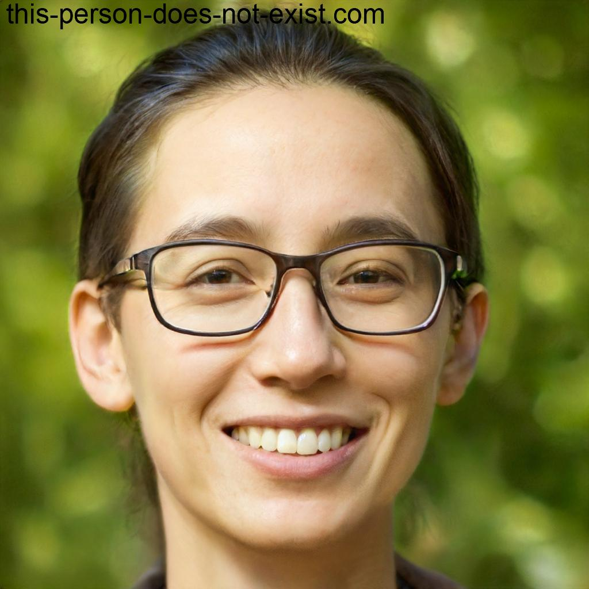
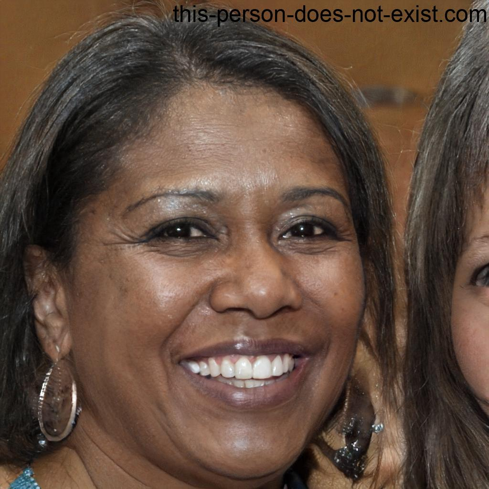

# 1.2.7 Personas

### Introdução  
As personas são representações semi-fictícias dos usuários que ajudam a compreender melhor seus comportamentos, motivações e necessidades. A construção dessas personas permite que a equipe desenvolva soluções mais eficazes e alinhadas ao perfil real dos usuários da plataforma.

### Metodologia  
As personas foram desenvolvidas com base nas discussões realizadas durante a fase de entendimento do Design Sprint, assim como em dados qualitativos levantados por meio de reuniões, dinâmicas e conhecimento prévio sobre o contexto da comunidade acadêmica da FCTE. 

As imagens utilizadas foram geradas por meio da ferramenta **This Person Does Not Exist**, que cria rostos fictícios com o uso de inteligência artificial, evitando o uso de fotos reais.

### Perfil de Usuário  
O perfil de usuário da plataforma é formado principalmente por **estudantes da FCTE**, que buscam um espaço seguro, prático e confiável para **trocar, vender ou doar itens usados**, especialmente materiais acadêmicos, roupas, eletrônicos e objetos do dia a dia.

Além dos estudantes, a plataforma também pode atrair **usuários engajados com práticas sustentáveis**, promovendo o reaproveitamento e a economia circular dentro da instituição.

### Objetivo  
Facilitar o processo de desapego, troca ou aquisição de itens entre membros da comunidade da FCTE, promovendo o consumo consciente.

### Expectativas  
- Interface simples e intuitiva  
- Busca eficiente e categorização dos anúncios  
- Segurança e confiabilidade nas interações  
- Ambiente exclusivo para membros da FCTE

### Personas e Anti-persona

#### Persona 1 – Lucas Andrade

<b>Figura 1:</b> Persona 1

| Atributo        | Descrição                                                                                                                                          |
| --------------- | -------------------------------------------------------------------------------------------------------------------------------------------------- |
| **Imagem**      |                                                                                                                      |
| **Nome**        | Lucas Andrade                                                                                                                                      |
| **Idade**       | 21 anos                                                                                                                                            |
| **Curso**       | Engenharia de Software - FCTE                                                                                                                      |
| **Semestre**    | 5º semestre                                                                                                                                        |
| **Objetivos**   | - Comprar itens usados por preço acessível    - Trocar livros entre semestres    - Doar roupas e eletrônicos                                 |
| **Frustrações** | - Preços altos em sites como OLX   - Falta de tempo para negociar   - Falta de confiança em vendedores externos                              |
| **Descrição**   | Estudante ativo na comunidade da FCTE. Gosta de bons negócios e valoriza segurança. Quer uma plataforma prática para troca e compra entre colegas. |

<em>Autor(a): Eduarda Tavares, 2025.</em>

#### Persona 2 – Ana Beatriz Ferreira

<b>Figura 2:</b> Persona 2

| Atributo        | Descrição                                                                                                                               |
| --------------- | --------------------------------------------------------------------------------------------------------------------------------------- |
| **Imagem**      |                                                                                                           |
| **Nome**        | Ana Beatriz Ferreira                                                                                                                    |
| **Idade**       | 24 anos                                                                                                                                 |
| **Curso**       | Engenharia Aeroespacial - FCTE                                                                                                          |
| **Semestre**    | 8º semestre                                                                                                                             |
| **Objetivos**   | - Doar objetos e roupas   - Promover consumo consciente   - Encontrar itens úteis para o dia a dia acadêmico                      |
| **Frustrações** | - Falta de um canal confiável   - Pouco tempo para interações longas   - Falta de organização entre tipos de anúncio              |
| **Descrição**   | Engajada com causas ambientais e sociais. Vê na plataforma uma oportunidade de estender ações sustentáveis ao ambiente virtual da FCTE. |

<em>Autor(a): Eduarda Tavares, 2025.</em>

#### Anti-persona – Regina Oliveira

<b>Figura 3:</b> Persona 3

| Atributo         | Descrição                                                                                                                            |
| ---------------- | ------------------------------------------------------------------------------------------------------------------------------------ |
| **Imagem**       |                                                                                                        |
| **Nome**         | Regina Oliveira                                                                                                                      |
| **Idade**        | 52 anos                                                                                                                              |
| **Profissão**    | Técnica administrativa                                                                                                               |
| **Escolaridade** | Ensino superior completo                                                                                                             |
| **Objetivos**    | - Renovar itens domésticos   - Doar objetos   - Apoiar causas sustentáveis                                                     |
| **Frustrações**  | - Pouca familiaridade com tecnologia   - Insegurança em transações online   - Falta de clareza sobre acessos à plataforma      |
| **Descrição**    | Engajada em causas sociais, mas com pouca afinidade com tecnologia. Não representa o público-alvo principal da plataforma acadêmica. |

<em>Autor(a): Eduarda Tavares, 2025.</em>

## Histórico de Versão

    <table>
        <tr>
            <th>Data</th>
            <th>Versão</th>
            <th>Descrição</th>
            <th>Autor</th>
            <th>Data da Revisão</th>
            <th>Revisor</th>
        </tr>
        <tr>
            <td>11/04/2025</td>
            <td>1.0</td>
            <td>Criação do documento</td>
            <td><a href="https://github.com/erteduarda">Arthur Suares</a></td>
            <td>11/04/2025</td>
            <td><a href="https://github.com/Jagaima">Davi Nobre </a></td>
        </tr>
    </table>

