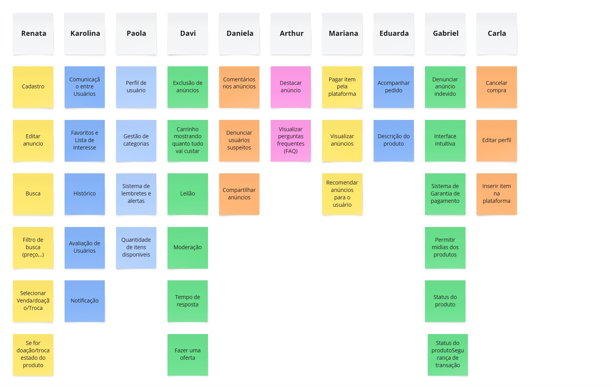

# 1.3.1 Brainstorm

## Tema
Plataforma web para trocas, doações e vendas entre membros da FGA.

## Objetivo
Mapear e priorizar funcionalidades que sejam úteis para a comunidade da FGA, prezando por segurança, usabilidade e foco na proposta de trocas e desapegos locais.

## Participantes
Renata Quadros Kurzawa, Davi Dos Santos Brito Nobre, Eduarda Rodrigues Tavares, Carla de Araujo Clementino Ribeiro, Gabriel Santos Monteiro, Mariana Letícia Santos da Cruz, Paola Rebeca Lima do Nascimento, Daniela, Arthur Miranda Soares, Karolina Vieira Barbosa.

#### Ideias Levantadas

<b>Figura 1:</b> Brainstorm Miro

<em>Autor(a): Eduarda Tavares, 2025.</em>

#### Funcionalidades Principais

<strong>Tabela 1: Ideias de Funcionalidades</strong>

| Funcionalidades                           |
| ----------------------------------------- |
| Editar anúncio                            |
| Busca                                     |
| Filtro de busca (preço, etc.)             |
| Comunicação entre Usuários                |
| Favoritos e Lista de Interesse            |
| Histórico                                 |
| Avaliação de Usuários                     |
| Notificação                               |
| Perfil de usuário                         |
| Gestão de categorias                      |
| Sistema de lembretes e alertas            |
| Exclusão de anúncios                      |
| Carrinho mostrando quanto tudo vai custar |
| Leilão                                    |
| Comentários nos anúncios                  |
| Denunciar usuários suspeitos              |
| Compartilhar anúncios                     |
| Selecionar Venda/Doação/Troca             |
| Destacar anúncio                          |
| Visualizar perguntas frequentes (FAQ)     |
| Pagar item pela plataforma                |
| Visualizar anúncios                       |
| Recomendar anúncios para o usuário        |
| Acompanhar pedido                         |
| Moderação                                 |
| Denunciar anúncio indevido                |
| Interface intuitiva                       |
| Sistema de Garantia de pagamento          |
| Permitir mídias dos produtos              |
| Cancelar compra                           |
| Editar perfil                             |
| Inserir item na plataforma                |
| Quantidade de itens disponíveis           |
| Se for doação/troca, estado do produto    |
| Status do produto                         |
| Descrição do produto                      |
| Fazer uma oferta                          |
| Tempo de resposta                         |
| Segurança de transação                    |

<em>Autor(a): Eduarda Tavares, 2025.</em>

## Histórico de Versão

    <table>
        <tr>
            <th>Data</th>
            <th>Versão</th>
            <th>Descrição</th>
            <th>Autor</th>
            <th>Data da Revisão</th>
            <th>Revisor</th>
        </tr>
        <tr>
            <td>11/04/2025</td>
            <td>1.0</td>
            <td>Criação do documento</td>
            <td><a href="https://github.com/erteduarda">Arthur Suares</a></td>
            <td>11/04/2025</td>
            <td><a href="https://github.com/Jagaima">Davi Nobre </a></td>
        </tr>
    </table>

