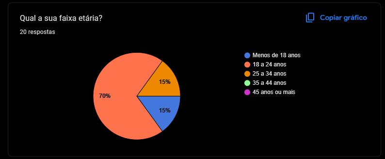

# 1.3.2 Questionário

## Introdução

Durante o processo de levantamento de requisitos do sistema, foi utilizada a técnica de Questionário como uma das formas de elicitação. Essa técnica tem como principal objetivo coletar informações de forma estruturada, permitindo alcançar um número maior de participantes e obter dados quantitativos e qualitativos sobre as necessidades, preferências e expectativas dos usuários.

## Objetivo

O objetivo deste questionário é identificar os principais requisitos que os usuários esperam no contexto de uso da solução proposta, de forma a guiar o desenvolvimento das funcionalidades do sistema e garantir que ele atenda às reais necessidades do público-alvo. Além disso, reutilizaremos para definir o perfil de usuário. 

O questionário foi destinado a alunos, professores, técnicos administrativos e colaboradores terceirizados da Faculdade de Ciências e Tecnologias do Gama (FCTE). Esse público representa diretamente os usuários da futura aplicação e permite compreender necessidades específicas do ambiente acadêmico.

## Metodologia da Aplicação
Forma de aplicação: Google Forms

Número de perguntas: 09 perguntas 

Tipo de perguntas: múltipla escolha e abertas

Número de respondentes: 22

Termo de Consentimento: Você está sendo convidado(a) a participar, de forma voluntária, da presente pesquisa, que tem como objetivo levantar o perfil dos usuários da comunidade FCTE para o desenvolvimento do projeto FCTEdesapega – uma plataforma para doação, troca ou venda de itens usados. A participação consiste em responder um questionário, com duração aproximada de 5 a 10 minutos. As respostas são anônimas e os dados coletados serão utilizados exclusivamente para fins acadêmicos, sendo tratados com sigilo e confidencialidade. Você poderá desistir da participação a qualquer momento, sem qualquer prejuízo. Ao prosseguir e responder ao questionário, você declara que leu e compreendeu as informações acima e concorda em participar da pesquisa.

## Questionário

<strong>Tabela 1: Estrutura do Questionário – FCTE Desapega</strong>

<table style="margin: auto; width: 80%; border-collapse: collapse;" border="1" cellpadding="8">
  <thead>
    <tr>
      <th style="text-align: center;">Seção</th>
      <th style="text-align: center;">Pergunta</th>
      <th style="text-align: center;">Opções de Resposta</th>
    </tr>
  </thead>
  <tbody>
    <tr>
      <td style="text-align: center;" rowspan="3">Perfil do Usuário</td>
      <td style="text-align: center;">Qual o seu vínculo com a FCTE?</td>
      <td style="text-align: center;">Técnico(a), Aluno(a), Professor(a), Outro</td>
    </tr>
    <tr>
      <td style="text-align: center;">Qual seu curso (ou área de atuação)?</td>
      <td style="text-align: center;">Engenharia Automotiva, Aerospacial, Eletrônica, Energia, Software, Outro</td>
    </tr>
    <tr>
      <td style="text-align: center;">Qual a sua faixa etária?</td>
      <td style="text-align: center;">Menos de 18, 18–24, 25–34, 35–44, 45 ou mais</td>
    </tr>
    <tr>
      <td style="text-align: center;" rowspan="3">Hábitos e Interesse em Desapego</td>
      <td style="text-align: center;">Você costuma doar, trocar ou vender objetos que não utiliza mais?</td>
      <td style="text-align: center;">Não, Sim (raramente), Sim (às vezes), Sim (frequentemente)</td>
    </tr>
    <tr>
      <td style="text-align: center;">Que tipo de item você mais se desfaz ou gostaria de se desfazer?</td>
      <td style="text-align: center;">Roupas, Livros, Eletrônicos, Móveis, Outro</td>
    </tr>
    <tr>
      <td style="text-align: center;">Você estaria disposto(a) a utilizar uma plataforma exclusiva da FCTE?</td>
      <td style="text-align: center;">Sim, Talvez, Não</td>
    </tr>
    <tr>
      <td style="text-align: center;" rowspan="3">Funcionalidades e Preferências</td>
      <td style="text-align: center;">Qual modelo de negociação mais te interessa?</td>
      <td style="text-align: center;">Doação, Troca, Venda, Todos</td>
    </tr>
    <tr>
      <td style="text-align: center;">Que tipo de funcionalidade você gostaria de ver na plataforma? (marcar múltiplas)</td>
      <td style="text-align: center;">Busca por categorias, Chat entre usuários, Avaliação de anunciantes, Notificações, Outro</td>
    </tr>
    <tr>
      <td style="text-align: center;">Tem alguma sugestão ou observação sobre como esse projeto pode ser mais útil pra comunidade FCTE?</td>
      <td style="text-align: center;">Resposta aberta</td>
    </tr>
  </tbody>
</table>

<em>Renata Quadros e Gabriel Monteiro, 2025.</em>

## Respostas 

| Resposta 1| Resposta 2|
| ------------------------------------------ | ------------------------------------------ |
|                     |                       |

| Resposta 3                     | Resposta 4                        |
| ------------------------------------------ | ------------------------------------------ |
|                 |              |

| Resposta 5| Resposta 6|
| ------------------------------------------ | ------------------------------------------ |
|                 |                   |

| Resposta 7                     | Resposta 8                        |
| ------------------------------------------ | ------------------------------------------ |
|                 |                  |

| Resposta 9| Resposta 10|
| ------------------------------------------ | ------------------------------------------ |
|                 |                   |

| Resposta 11                     |
| ------------------------------------------ |
|                     |

<strong> Histórico de Versões</strong>

<table style="margin: auto; width: 40%; border-collapse: collapse;" border="1" cellpadding="8">
  <thead>
    <tr>
      <th style="text-align: center;">Versão</th>
      <th style="text-align: center;">Data</th>
      <th style="text-align: center;">Descrição</th>
      <th style="text-align: center;">Autor(es)</th>
      <th style="text-align: center;">Revisor(es)</th>
    </tr>
  </thead>
  <tbody>
    <tr>
      <td style="text-align: center;">1.0</td>
      <td style="text-align: center;">08/04/2025</td>
      <td style="text-align: center;">Adicionado introdução, objetivo, metodologia e perguntas do questionário</td>
      <td style="text-align: center;"><a href="https://github.com/RenataKurzawa">Renata Quadros</a></td>
      <td style="text-align: center;"><a href="https://github.com/GabrielSMonteiro">Gabriel Monteiro</a></td>
    </tr>
  </tbody>
  <tbody>
    <tr>
      <td style="text-align: center;">1.1</td>
      <td style="text-align: center;">09/04/2025</td>
      <td style="text-align: center;">Adicionado respostas do questionário</td>
      <td style="text-align: center;"><a href="https://github.com/GabrielSMonteiro">Gabriel Monteiro</a></td>
      <td style="text-align: center;"></td>
    </tr>
  </tbody>
</table>
