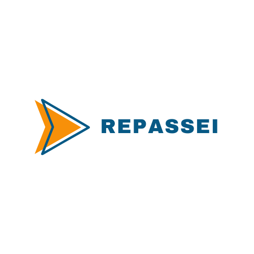

# 1.5.2 Identidade Visual

## Introdução

A identidade visual do projeto **REPASSEI** foi cuidadosamente desenvolvida para refletir os valores centrais da plataforma: **inovação, tecnologia e responsabilidade ambiental**. Mais do que uma escolha estética, cada elemento visual foi pensado para criar **coerência e reconhecimento**, fortalecendo a presença da marca em diferentes canais de comunicação.

O objetivo da identidade visual é garantir uma linguagem gráfica que seja **funcional, acessível e visualmente impactante**, oferecendo uma experiência consistente para os usuários e alinhada ao propósito do sistema de monitoramento ambiental.

O sistema visual foi construído com base em dois pilares principais: **tipografia** e **paleta de cores**, que juntos reforçam a proposta moderna e confiável do projeto.

## Sobre a Identidade Visual

A identidade visual deste sistema web foi cuidadosamente desenvolvida para comunicar de forma clara, organizada e consistente a proposta da plataforma: conectar usuários e produtos em um ambiente digital acessível, confiável e intuitivo. Esse conjunto de elementos gráficos — como o logotipo, a paleta de cores, a tipografia e os componentes visuais — foi estruturado para refletir os valores de profissionalismo, simplicidade e eficiência que a plataforma deseja transmitir.

Funcionando como um verdadeiro "cartão de visita", a identidade visual confere personalidade ao projeto, diferenciando-o no mercado e fortalecendo sua imagem perante o público-alvo. Cada tela, como as de login, cadastro, navegação de produtos, criação de anúncios, perfil de usuário e FAQ, foi pensada para manter a coerência estética e funcional, promovendo uma experiência fluida e harmoniosa.

A consistência na aplicação desses elementos é fundamental para consolidar o reconhecimento da marca e criar uma relação de confiança com o usuário. Assim, este manual de identidade visual serve como um guia prático para assegurar a padronização e integridade do design em todas as interfaces e materiais da plataforma.
O objetivo é garantir que a comunicação visual mantenha uma aparência unificada, reforçando o posicionamento inovador e profissional do sistema em todas as suas formas de apresentação.

## Logo 

O símbolo principal da identidade visual da plataforma REPASSEI foi desenvolvido para comunicar de forma direta e impactante os valores centrais do projeto: agilidade, simplicidade e confiança na troca e divulgação de produtos. A seta laranja estilizada, voltada para a direita, representa o ato de repassar — um gesto de continuidade, avanço e compartilhamento, que está no cerne da proposta da plataforma.
Sua forma dinâmica e cor vibrante criam uma sensação de movimento e ação, ao mesmo tempo em que o contorno azul escuro transmite estabilidade e credibilidade. A combinação desses elementos visuais reforça o equilíbrio entre acessibilidade e seriedade, atributos fundamentais para uma plataforma de anúncios.
O logotipo, composto pela seta e pela palavra “REPASSEI” em letras maiúsculas, foi desenhado para garantir legibilidade, presença visual e harmonia com o símbolo. A tipografia escolhida é moderna, limpa e objetiva, refletindo a natureza digital e funcional do produto, enquanto mantém um toque amigável e acessível ao público.
A construção da marca visa transmitir de forma clara a missão da plataforma: facilitar o repasse de produtos de maneira prática, segura e eficaz, conectando pessoas por meio de uma experiência visual simples e direta.

   
   

  
 <b>Autor:</b> <a href="https://github.com/ccarlaa">Carla Clementino</a>
 

## Tipografia

A tipografia desempenha um papel essencial na construção da identidade visual da plataforma REPASSEI, garantindo coesão e consistência em todos os pontos de contato com o usuário. Ela não apenas diferencia o projeto visualmente, como também reforça sua unidade e transmite uma imagem de profissionalismo, clareza e dinamismo.
Para compor essa identidade, foram escolhidas duas famílias tipográficas que se complementam em estilo e função: Archivo Black e Inter, cada uma com um papel estratégico no sistema de comunicação visual.

**Archivo Black** foi selecionada para o logotipo e títulos de destaque. Com seu peso forte, traços robustos e aparência impactante, essa fonte confere autoridade, presença e uma pegada moderna à marca. Seu estilo é ideal para reforçar a força da proposta do REPASSEI — direta, acessível e com personalidade.

**Inter**, por sua vez, foi escolhida para os textos corridos, descrições, conteúdos auxiliares e qualquer material que demande leitura fluida. Reconhecida por sua legibilidade em interfaces digitais, essa fonte proporciona clareza e conforto visual, sendo ideal para aplicações como páginas da web, painéis e materiais institucionais.

A combinação dessas duas fontes promove um equilíbrio entre impacto visual e funcionalidade, refletindo os valores do projeto: acessibilidade, confiança e inovação. Todas as variações de peso devem ser utilizadas de forma planejada, seguindo as diretrizes da identidade visual, para assegurar uma comunicação consistente e visualmente harmônica em todas as plataformas.

<iframe style="border: 1px solid rgba(0, 0, 0, 0.1);" width="800" height="600" src="https://embed.figma.com/design/HV5yo4XnFPWMVzsv0rQrNd/Arquitetura?node-id=4-14&embed-host=share" allowfullscreen></iframe>

 <b>Autor:</b> <a href="https://github.com/ccarlaa">Carla Clementino</a>
 

## Cores

As cores são componentes essenciais na construção da identidade visual do REPASSEI, pois reforçam os valores e o conceito do projeto, além de torná-lo facilmente reconhecível e memorável. A paleta foi cuidadosamente elaborada para refletir os pilares centrais da marca: inovação, tecnologia, responsabilidade ambiental e acessibilidade.
A paleta principal é composta por tons de azul vibrante, amarelo terroso e cinza moderno, que comunicam confiança, energia e profissionalismo. Cada cor cumpre uma função estratégica dentro do sistema visual:

**Azul (Primary)** – Transmite dinamismo, inovação e conexão tecnológica. Seus tons variam da leveza do azul-claro à intensidade do azul-profundo, garantindo versatilidade tanto em elementos de destaque quanto em interfaces digitais.

**Amarelo (Secondary)** – Representa acessibilidade, positividade e energia. Seu uso remete à ideia de orientação e suporte, dialogando diretamente com o conceito de “repasse” de informações e conhecimentos.

**Cinza (Gray)** – Garante equilíbrio e sofisticação, sendo ideal para textos, ícones e fundos neutros. Confere estabilidade ao design e reforça a clareza da informação.

Além dessas, a paleta conta com cores semânticas, como:

**Vermelho (Error)** – Aplicado para alertas e erros, reforçando a atenção do usuário de forma clara e acessível.

**Verde (Success)** – Indica sucesso, confirmações e ações concluídas, promovendo uma comunicação intuitiva e eficiente.

Todas as cores foram otimizadas para manter consistência tanto em ambientes digitais (RGB) quanto em materiais impressos (CMYK), assegurando fidelidade cromática em todas as aplicações. A tonalidade Main de cada cor representa o uso principal e preferencial da respectiva categoria, devendo ser priorizada na composição visual.
A aplicação estratégica dessa paleta fortalece a identidade visual do REPASSEI, transmitindo seus valores com clareza e assegurando coesão em todas as plataformas e materiais. Manter a integridade cromática é fundamental para preservar o reconhecimento e a força da marca.

<iframe style="border: 1px solid rgba(0, 0, 0, 0.1);" width="800" height="550" src="https://embed.figma.com/design/HV5yo4XnFPWMVzsv0rQrNd/Arquitetura?node-id=4-287&embed-host=share" allowfullscreen></iframe>

 <b>Autor:</b> <a href="https://github.com/ccarlaa">Carla Clementino</a>
 

## Ícones

Para garantir uma comunicação visual clara, moderna e acessível, a aplicação faz uso da biblioteca **[Heroicons](https://heroicons.com/)** — uma coleção de ícones desenvolvida pela equipe do Tailwind Labs. 

Os ícones foram escolhidos por sua **simplicidade, legibilidade e consistência visual**, alinhando-se ao estilo flat e minimalista adotado no restante do projeto. Essa abordagem facilita a rápida identificação das ações e conteúdos da interface, contribuindo para a usabilidade da aplicação.

Todos os ícones utilizados são **vetoriais (SVG)**, garantindo alta qualidade visual em diferentes resoluções e tamanhos de tela. Eles também foram aplicados com atenção às diretrizes de acessibilidade, respeitando a hierarquia visual, o contraste com o fundo e o significado semântico de cada ícone.

A utilização dos Heroicons também contribui para manter a leveza da aplicação, já que a biblioteca é modular e permite importar apenas os ícones necessários.

Essa escolha reforça a proposta visual do REPASSEI de ser uma plataforma **eficiente, acessível e visualmente coesa**.

## Componentes da Interface

Os componentes da interface foram desenvolvidos com foco na consistência visual, reutilização e acessibilidade. A construção de uma biblioteca de componentes próprios permite que a aplicação mantenha uma identidade visual coesa, independentemente da complexidade ou do número de telas.

Cada componente — como botões, inputs, dropdowns, cards e popovers — foi pensado para atender às necessidades de usabilidade da aplicação, promovendo interações claras e objetivas. Além disso, a modularidade desses elementos facilita tanto a manutenção quanto a escalabilidade do projeto, garantindo que novos recursos possam ser implementados sem comprometer a estrutura existente.

A adoção de componentes reutilizáveis também colabora com a eficiência no desenvolvimento, reduzindo a duplicação de código e promovendo maior padronização entre as diferentes áreas da aplicação. Essa abordagem reforça a experiência do usuário e contribui para uma navegação mais intuitiva e agradável.

<iframe style="border: 1px solid rgba(0, 0, 0, 0.1);" width="800" height="450" src="https://embed.figma.com/design/HV5yo4XnFPWMVzsv0rQrNd/Arquitetura?node-id=0-1&embed-host=share" allowfullscreen></iframe>

 <b>Autor:</b> <a href="https://github.com/ccarlaa">Carla Clementino</a>
 

## Formas Incorretas de Aplicação

Para garantir a integridade e a coesão da identidade visual, é essencial seguir rigorosamente as diretrizes estabelecidas neste manual. Qualquer aplicação inadequada pode comprometer a essência, o significado e o reconhecimento da marca, além de afetar a sua percepção pelo público.
As formas não recomendadas de uso incluem:

**Alteração da tipografia institucional:** Substituir as fontes definidas (Inter e Lexend) compromete a harmonia e a legibilidade da identidade visual.

**Distorção horizontal ou vertical:** Ajustar a proporção do símbolo ou do logotipo resulta em uma aparência desequilibrada e não profissional.

**Deslocamento do símbolo ou descritor:** Alterar a posição relativa entre o símbolo e o texto desconfigura a composição original da marca.

**Aplicação de efeitos 3D:** Adicionar profundidade ou elementos tridimensionais descaracteriza a simplicidade e clareza do design.

**Girar o símbolo:** Modificar a orientação do símbolo compromete a coerência visual.

**Aplicação de contornos:** Inserir bordas ou traços ao redor do símbolo ou do logotipo altera sua aparência original.

**Adicionar sombras:** Efeitos de sombra comprometem a leveza e a clareza visual.

**Aplicação de gradientes:** O uso de gradientes modifica as cores estabelecidas, prejudicando a consistência cromática.

Manter a aplicação correta da identidade visual é indispensável para preservar a integridade e o impacto da marca.

## Histórico de Versão

    <table>
        <tr>
            <th>Data</th>
            <th>Versão</th>
            <th>Descrição</th>
            <th>Autor</th>
            <th>Data da Revisão</th>
            <th>Revisor</th>
        </tr>
        <tr>
            <td>11/04/2025</td>
            <td>1.0</td>
            <td>Adicionado identidade</td>
            <td><a href="https://github.com/ccarlaa">Carla Clementino</a></td>
            <td>11/04/2025</td>
            <td><a href="https://github.com/erteduarda">Eduarda Tavares</a></td>
        </tr>
    </table>

