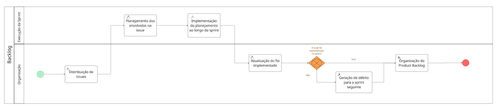
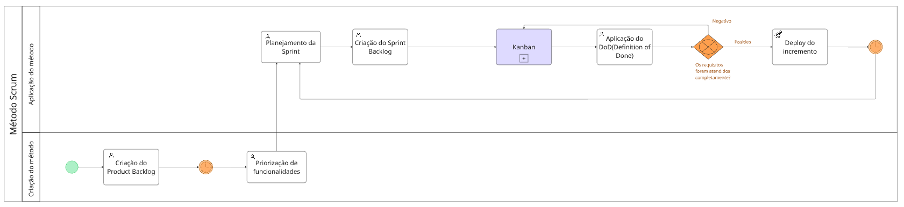
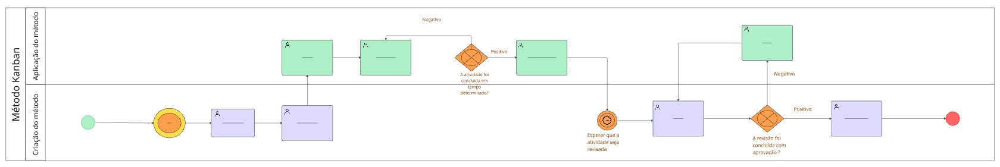
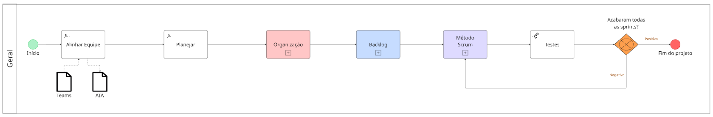
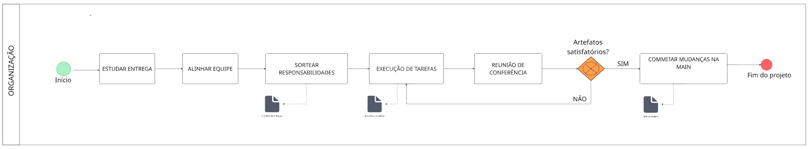

# 1.7.2 Modelagem

## Diagramas BPMN

Nesta seção, apresentamos os diagramas BPMN que representam o processo de desenvolvimento do projeto. Cada diagrama foi elaborado com base nas estratégias adotadas e nas etapas reais do nosso fluxo de trabalho.

A seguir, estão os diagramas criados:

### Diagrama 1 – Execução da Sprint
Representa o fluxo desde a distribuição das issues até a organização final do Product Backlog, com verificação de implementação durante a sprint.

<strong>Figura 1: Execução da Sprint</strong>

<em>Eduarda Tavares, 2025.</em>

## Diagrama 2 – Aplicação do Método Scrum
Descreve como o grupo aplica o Scrum com adaptações, contemplando a criação e priorização do backlog, uso do Kanban e definição de critérios de entrega.

<strong>Figura 2: Aplicação do Método Scrum</strong>

<em>Eduarda Tavares, 2025.</em>

## Diagrama 3 – Aplicação do Kanban
Ilustra como o Kanban está sendo utilizado pelo grupo, incluindo a verificação de prazos e a etapa de revisão e aprovação das atividades.

<strong>Figura 3: Aplicação do Kanban</strong>

<em>Eduarda Tavares, 2025.</em>

## Diagrama 4 – Visão Geral do Projeto
Mostra o fluxo geral do projeto, desde o alinhamento inicial da equipe até os testes e verificação de conclusão das sprints.

<strong>Figura 4: Visão Geral do Projeto</strong>

<em>Eduarda Tavares, 2025.</em>

## Diagrama 5 – Organização e Entrega dos Artefatos
Apresenta a organização das tarefas relacionadas à entrega de artefatos, com validação final e encerramento do projeto.

<strong>Figura 5: Organização e Entrega dos Artefatos</strong>

<em>Eduarda Tavares, 2025.</em>

#### E abaixo está o trabalho feito no utilizando a plataforma Miro

<iframe width="768" height="432" src="https://miro.com/app/board/uXjVIE8U1cM=/" frameborder="0" scrolling="no" allowfullscreen></iframe>

<em>Eduarda Tavares, 2025.</em>

## Histórico de Versão

    <table>
        <tr>
            <th>Data</th>
            <th>Versão</th>
            <th>Descrição</th>
            <th>Autor</th>
            <th>Data da Revisão</th>
            <th>Revisor</th>
        </tr>
        <tr>
            <td>08/04/2025</td>
            <td>1.0</td>
            <td>Criação do documento</td>
            <td><a href="https://github.com/erteduarda">Eduarda Tavares</a></td>
            <td>08/04/2025</td>
            <td><a href="https://github.com/Jagaima">Davi Nobre</a></td>
        </tr>
    </table>

