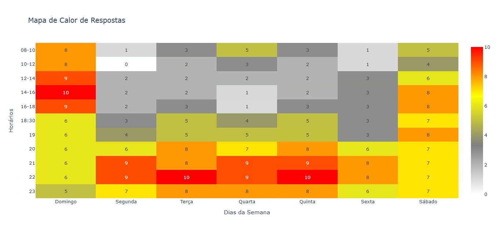
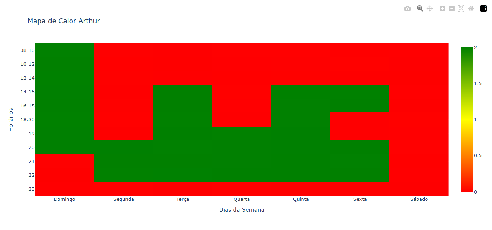

# 1.8. Heatmap

## HeatMap

### Introdução

O Heatmap é uma ferramenta visual poderosa utilizada para representar a disponibilidade dos membros da equipe de forma intuitiva e eficiente. Por meio de uma matriz de cores, o mapa de calor permite visualizar rapidamente os períodos em que cada integrante está disponível, parcialmente disponível ou indisponível para atividades do projeto.

Esta representação gráfica facilita o planejamento de reuniões, a distribuição de tarefas e a organização geral do projeto, permitindo que gestores e membros da equipe identifiquem instantaneamente janelas de oportunidade para colaboração e potenciais gargalos na disponibilidade coletiva.

A escala de cores utilizada segue um padrão intuitivo:
- **Verde**: Indica total disponibilidade do membro da equipe
- **Amarelo**: Representa disponibilidade parcial ou mediante aviso prévio
- **Vermelho**: Sinaliza indisponibilidade completa

### Metodologia

Para o desenvolvimento desse artefato foram utilizadas duas técnicas complementares:

1. **Coleta de Dados**: Os membros preencheram uma planilha estruturada indicando suas disponibilidades em diferentes dias da semana e horários. Utilizamos três categorias de disponibilidade:
   - Disponível (verde)
   - Disponível com aviso prévio (amarelo)
   - Indisponível (vermelho)

2. **Visualização de Dados**: Com a biblioteca `plotly.express` do Python, processamos os dados coletados para gerar o mapa de calor visual de cada membro individualmente e o resultado consolidado da equipe.

No modelo implementado, o eixo X representa os dias da semana (de domingo a sábado) e o eixo Y representa os horários disponíveis (das 8h às 23h), criando uma matriz visual onde as cores indicam o nível de disponibilidade em cada período.

Na Imagem 01 abaixo, apresentamos o Heatmap do resultado final de disponibilidade dos membros, permitindo uma visualização consolidada das janelas de oportunidade para atividades em equipe. Abaixo é possível ver o heatmap de cada um dos membros.

**Imagem 01** - Heatmap de disponibilidade de membros

Heatmap Arthur

    <table>
        <tr>
            <th>Data</th>
            <th>Versão</th>
            <th>Descrição</th>
            <th>Autor</th>
            <th>Data da Revisão</th>
            <th>Revisor</th>
        </tr>
        <tr>
            <td>06/04</td>
            <td>1.0</td>
            <td>Criação do documento</td>
            <td><a href="https://github.com/GabrielSMonteiro">Gabriel Monteiro</a></td>
            <td></td>
            <td><a</a></td>
        </tr>
    </table>

