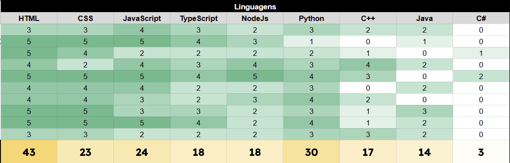
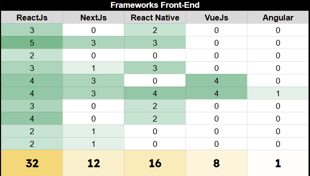
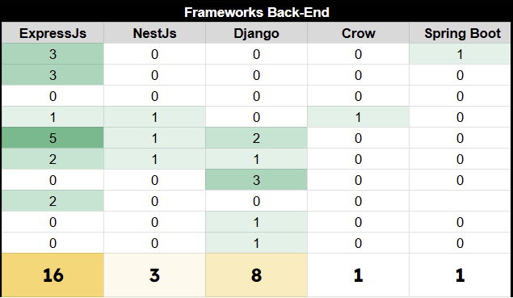
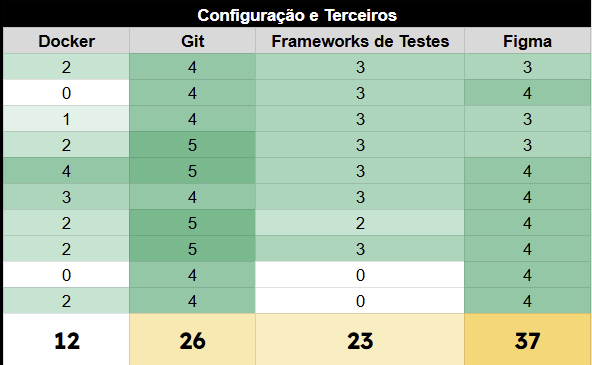

# 1.9. Tabela de conhecimentos da equipe

## Distribuição do conhecimento

Em relação a obter dados sobre o conhecimento dos participantes do grupo, foi aferida uma tabela com uma nota variando de 0 a 5 em diversas linguagens, frameworks de Back-end e Front-end entre outras configurações. Nesse quesito, segue abaixo as tabelas demonstrando o conhecimento de cada um além de um breve comentário sobre as tecnologias de maior conhecimento.

### Linguagens

Tabela 1: Tabela de conhecimentos sobre linguagens. (Fonte: <a href="https://github.com/Marianannn">Mariana Letícia</a>)

Conforme a pontuação sobre as linguagens mostram, a equipe apresenta muito conhecimento em linguagens de estilização, marcação, o que significa que em relação a implementação de design de interface teremos vantagem, além de termos conhecimento sobre as linguagens mais presentes nos frameworks de back-end e front-end como JavaScript e Python.

### Frameworks Front-end

Tabela 2: Tabela de conhecimentos sobre Frameworks Front-end. (Fonte: <a href="https://github.com/Marianannn">Mariana Letícia</a>)

Conforme é possível visualizar, o conhecimento da equipe é mais direcionado ao Framework de Front-end ReactJs, sendo também plausível para o projeto que será desenvolvido em um site.

### Frameworks Back-end

Tabela 3: Tabela de conhecimentos sobre Frameworks Back-end. (Fonte: <a href="https://github.com/Marianannn">Mariana Letícia</a>)

   

Dentre os Frameworks back-end mais conhecidos pela equipe o que mais se destacou foi o ExpressJs, compatível com a proposta do nosso projeto.

### Configuração e Terceiros

Tabela 4: Tabela de conhecimentos sobre Ferramentas de configuração de ambiente e terceiros. (Fonte: <a href="https://github.com/Marianannn">Mariana Letícia</a>)

A equipe também possui conhecimento significativo em prototipação, git e frameworks de teste, o que pode levá-la a Metodologias ágeis voltadas ao desenvolvimento de testes para realizar a aplicação.

---

# Histórico de versões

    <table>
        <tr>
            <th>Data</th>
            <th>Versão</th>
            <th>Descrição</th>
            <th>Autor</th>
            <th>Data da Revisão</th>
            <th>Revisor</th>
        </tr>
        <tr>
            <td>10/04</td>
            <td>1.0</td>
            <td>Criação do documento e adição da distribuição do conhecimento e tabelas de conhecimento</td>
            <td><a href="https://github.com/Marianannn">Mariana Letícia</a></td>
            <td>11/04/2025</td>
            <td><a href="https://github.com/Jagaima">Davi Brito</a></td>
        </tr>
    </table>

